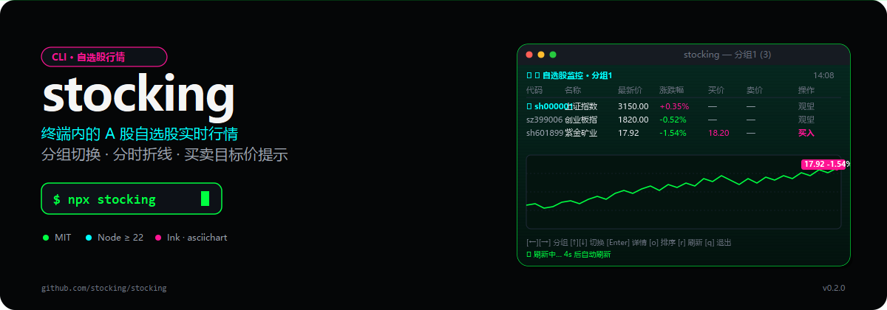

<p align="center">
  
</p>

<p align="center">
  <a href="https://www.npmjs.com/package/stocking"></a>
  
  
  
</p>

> 终端里的 A 股自选股实时行情监控：分组切换、asciichart 分时折线、买卖目标价提示。键盘就能看盘。

## 快速开始

```bash
npx stocking
```

首次启动会在 `~/.stocking/settings.json` 写入默认配置（两个分组），按提示编辑即可。Node.js 需要 **>= 22**。

## 它能做什么

- **多分组管理** — 把不同板块（指数 / 持仓 / 关注）分到不同分组，←/→ 一秒切换
- **实时行情** — 5 秒自动刷新，从腾讯财经接口拉快照（带本地兜底数据）
- **分时折线** — 进详情页看 asciichart 风格的全天分时图，10 秒更新
- **买卖目标价** — 在 `settings.json` 给每只股票设 `buyPrice` / `sellPrice`，触发条件时高亮提示
- **排序 / 折叠** — `o` 切换按涨跌幅升降序，`h` 切换暗色模式

## 键盘速查

| 按键         | 列表视图             | 详情视图              |
| ------------ | -------------------- | --------------------- |
| `←` `→` `[/]` | 切换分组             | —                     |
| `↑` `↓` `jk` | 上下选中             | —                     |
| `Enter`      | 进入详情             | —                     |
| `b` / `s`    | —                    | 编辑买入 / 卖出目标价 |
| `Esc` `q`    | 退出                 | 返回列表              |
| `r`          | 立即刷新             | —                     |
| `o`          | 切换排序             | —                     |
| `h`          | 切换暗色模式         | —                     |
| `Ctrl+C`     | 退出（双击强制退出） | —                     |

## 配置示例

编辑 `~/.stocking/settings.json`：

```json
{
  "groups": [
    {
      "name": "指数",
      "symbols": [
        { "code": "sh000001" },
        { "code": "sz399006" },
        { "code": "sh000300" }
      ]
    },
    {
      "name": "持仓",
      "symbols": [
        { "code": "sh601318", "buyPrice": 38.5, "sellPrice": 45.0 },
        { "code": "sz000858", "buyPrice": 145, "sellPrice": 180 }
      ]
    }
  ]
}
```

- 旧版（`{ symbols: [...] }`）会自动迁移到分组结构，原股票归入「分组 1」
- 单分组会自动补一个空的「分组 2」便于切换
- `buyPrice` / `sellPrice` 缺省或非法值不参与触发判断

## 常用代码

| 标的类型 | 代码示例  | 前缀  |
| -------- | --------- | ----- |
| 上证     | 601318    | sh    |
| 深证     | 000858    | sz    |
| 创业板   | 300750    | sz    |
| 科创板   | 688981    | sh    |
| 指数     | 000001    | sh    |

可只填数字（`601318`），CLI 会自动补前缀。

## 工作原理

- `src/index.tsx` — Commander 入口 + Ink 启动
- `src/StockList.tsx` — 列表 / 详情 UI、键盘事件、目标价编辑
- `src/market.ts` — 行情数据获取与本地分时缓存
- `src/settings.ts` — `~/.stocking/settings.json` 读写、v1→v2 迁移、容错清洗
- `src/groups.ts` — 分组切换、目标价写入的纯函数（带单元测试）

数据源在 `src/market.ts` 内部维护，不在此公开。如接口迁移，修改该文件即可。

## 局限

- 数据来自第三方公开接口，**不保证实时性和准确性**，请勿用于实盘决策
- 列表页 5 秒自动刷新一次，详情页 10 秒一次
- 网络失败时回退到本地示例数据，界面仍能渲染

## 开发

```bash
git clone https://github.com/Awu12277/stocking.git
cd stocking
npm install
npm run dev        # tsup watch 模式
npm run build      # 生产构建
npm run type-check # tsc --noEmit
```

## License

[MIT](./LICENSE)
